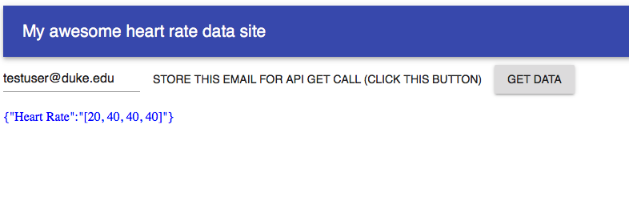

# doctor-hr-frontend

This is a web-app developed using React. In this application, given that the webserver and database are running, one is able to extract data from the database and display it. Currently, the end-user is able to input an email (User), and then save the user, and fetchData (type, click button, click button). Fetching the data will perform a GET request on the User's HR measurements.



To install this app, download it and then run

```
npm install
```

After installation, simply run the app by typing

```
npm start
```
